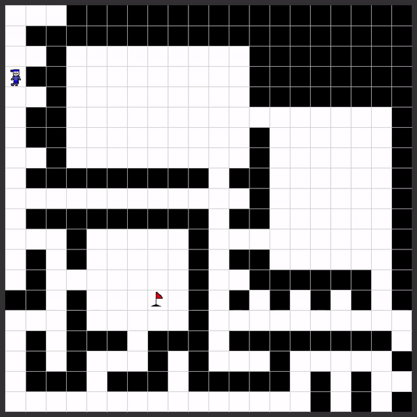

# rl-envs-forge
Lightweight environments for reinforcement learning applications.

## Table of Contents
- [Installation](#installation)
- [Environments](#environments)
  - [Labyrinth](#labyrinth)
- [Usage](#usage)
- [License](#license)
- [Contact & Support](#contact--support)

## Installation


```bash
pip install rl-envs-forge
```

## Environments
### Labyrinth 

Labyrinth is a classic maze-solving environment, where the goal is to navigate from a start point to a target. The maze layout is randomly generated based on a set of parametrizable arguments.

📖 **Detailed Documentation**: [Click here to read more about the Labyrinth environment](./rl_envs_forge/envs/labyrinth/README.md)

### Rendered example



## Usage

Example code on setting up and testing the Labyrinth environment.

Note, this code snippet produced the render visible in section [Labyrinth](#labyrinth)

```python
from time import sleep
from rl_envs_forge.envs.labyrinth.labyrinth import Labyrinth

env = Labyrinth(20, 20, seed=0)

done = False
quit_event = False
while not done and not quit_event:
    action = env.action_space.sample()  
    observation, reward, done, _, info = env.step(action)
    quit_event, _ = env.render()
    sleep(0.1)
```


## License

This project is licensed under the [MIT License](./LICENSE).

## Contact & Support

For any queries or support, or if you would like to contribute to this project, reach out at [marius.dragomir.dgm@gmail.com](mailto:marius.dragomir.dgm@gmail.com) or raise an issue on our GitHub repository.