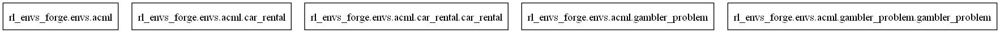
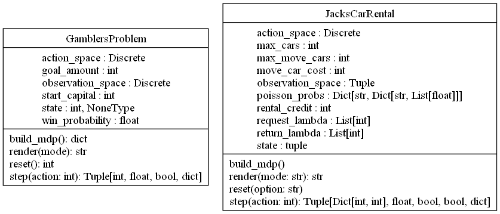

# ACML environments

The Adaptive Computation and Machine Learning (ACML) environments are a collection of toy environments presented.

## Implemented Environments
- JacksCarRentalEnv: Jack's Car Rental problem

## Usage

### Jack's Car Rental
Code example for getting started with the environment:

```python
from rl_envs_forge.envs.acml.car_rental.car_rental_env import JacksCarRentalEnv

env = JacksCarRentalEnv(
    max_cars=10,
    max_move_cars=3,
    request_lambda=[2, 2],
    return_lambda=[2, 2],
    init_state_option="equal",
)
env.state
```

```output
(5, 5)
```

```python
env.step(2)
```

```output
((5, 3), 48, False, False, {})
```

Usage with policy iteration: [Algorithm Repository](https://github.com/mariusdgm/phd-rl-algos)

## UML diagrams

### Packages



### Classes



## References

- Sutton, R. S., & Barto, A. G. (2018). *Reinforcement Learning: An Introduction* (2nd ed.). MIT Press. (Adaptive Computation and Machine Learning series).