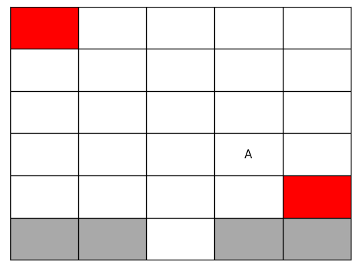
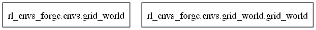
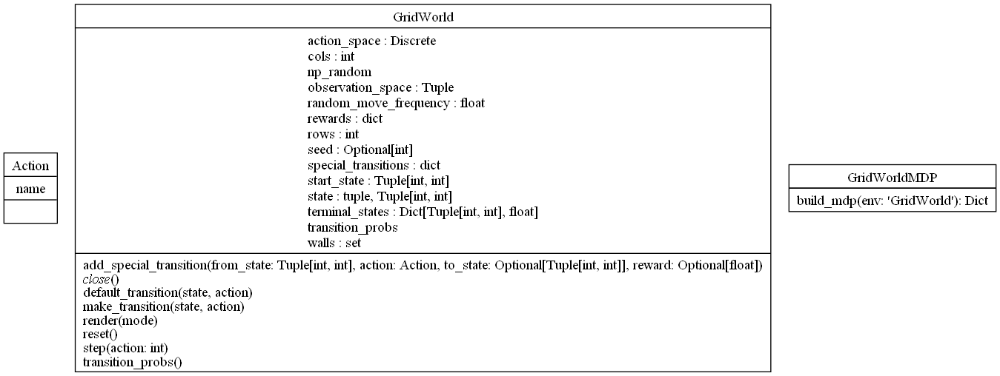

# GridWorld environment 

The GridWorld environment is a grid-based simulation for reinforcement learning.. In this environment, an agent navigates through a grid, choosing actions (up, down, left, right) to move between cells, encountering various states. Some cells are terminal states, ending the episode, while others may contain walls or special transitions that alter the agent's path or rewards. The agent's goal is to maximize cumulative rewards, obtained by navigating efficiently while avoiding penalties like hitting walls. This setup offers a rich scenario for learning decision-making under uncertainty, ideal for testing reinforcement learning algorithms.


## Usage

Code example for getting started with the environment:

```python
from rl_envs_forge.envs.grid_world.grid_world import GridWorld

env = GridWorld(rows=6, 
                walls=[(5, 0), (5, 1), (5, 3), (5, 4)],
                start_state=(1,1),
                terminal_states={(0, 0): 1.0,
                                 (4, 4): 1.0},
                )
env.render()
```


#### Making a special transition:

```python
special_state = env.state 
special_action = Action.DOWN
jump_state = (3, 3)
special_reward = 0.5
env.add_special_transition(
    from_state=special_state, 
    action=special_action, 
    to_state=jump_state, 
    reward=special_reward
)

# Test the special transition
new_state, reward, _, _, _ = env.step(special_action)
env.render()
```



## UML diagrams

### Packages



### Classes


