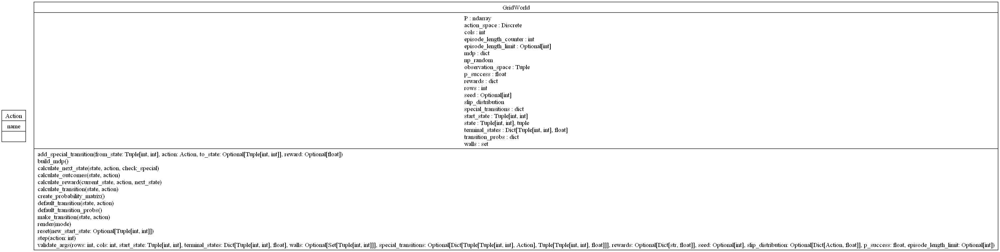

# GridWorld environment 

The k-armed bandit problem is a classic dilemma in probability theory and statistics which models the decision-making process of choosing between multiple strategies (or actions) with uncertain outcomes. Imagine standing in front of a slot machine with k levers (or "arms"). Each lever provides a reward drawn from an unknown probability distribution specific to that lever. The challenge is to determine a strategy to maximize your total reward over a series of trials, without knowledge of the underlying distributions.


## Usage

Code example for getting started with the environment:

```python
from rl_envs_forge.envs.grid_world.grid_world import GridWorld

GridWorld
```

```output

```

```python
GridWorld.render()
```


## UML diagrams

### Packages


### Classes


