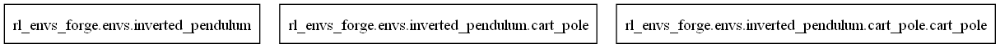

# Inverted pendulum environments

The inverted pendulum problem is a classic challenge in control theory and reinforcement learning, modeling the task of balancing a pendulum in an unstable equilibrium. Imagine a pendulum attached to a pivot point that can move horizontally.

The objective is to apply forces to maintain the pendulum upright despite disturbances and the natural tendency to fall. This problem exemplifies the need for precise control and is fundamental in illustrating various control strategies.

## Environments

- CartPole - [CartPole](cart_pole.md)

## UML diagrams

### Packages

### Classes

