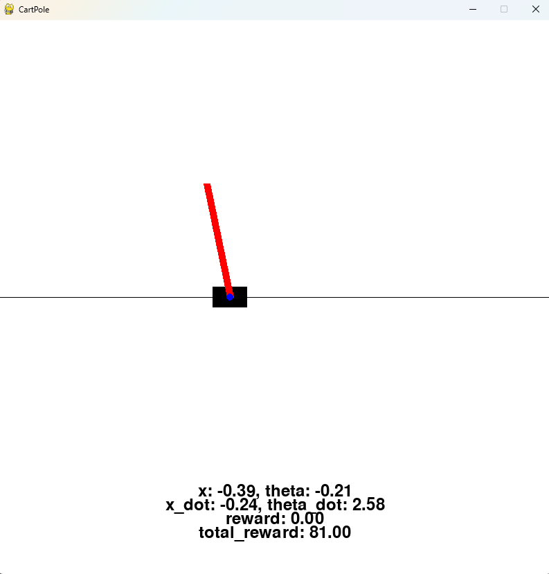

# CartPole

CarPole is a classic 2D environment where the agent must learn to balance a pole on a cart.  

Different environment setups are presented in [Usage](#usage).

## Usage

### Basic Initialization

```python
from rl_envs_forge.envs.inverted_pendulum.cart_pole.cart_pole import CartPole

env = CartPole(tau=0.02)  # Set the integration time step to 0.02 seconds
state, info = env.reset()

action = env.action_space.sample()  # Sample a random action
next_state, reward, done, truncated, info = env.step(action)
print(next_state, reward, done, truncated, info)
```

```
[-0.00880992  0.05337294 -0.00476914 -0.09155615] 1.0 False False {'truncated': False, 'x_acc': 2.744742412611468, 'theta_acc': -4.184865386909861, 'force': 2.8099756, 'steps': 1}
```

### Custom Initialization with Continuous Reward
```python
env = CartPole(tau=0.02, continuous_reward=True)
state, info = env.reset()

action = env.action_space.sample()  # Sample a random action
next_state, reward, done, truncated, info = env.step(action)
print(next_state, reward, done, truncated, info)
```

```
[ 0.00909999  0.04140016 -0.00273255 -0.06122324] 0.9863372562695047 False False {'truncated': False, 'x_acc': 2.312239802874169, 'theta_acc': -3.5111593829089087, 'force': 2.3679066, 'steps': 1}
```

### Rendering the Environment

```
env = CartPole(tau=0.02)
state, info = env.reset()

for _ in range(1000):
    env.render()
    action = env.action_space.sample()
    next_state, reward, done, truncated, info = env.step(action)
    if done or truncated:
        break

env.close()
```



