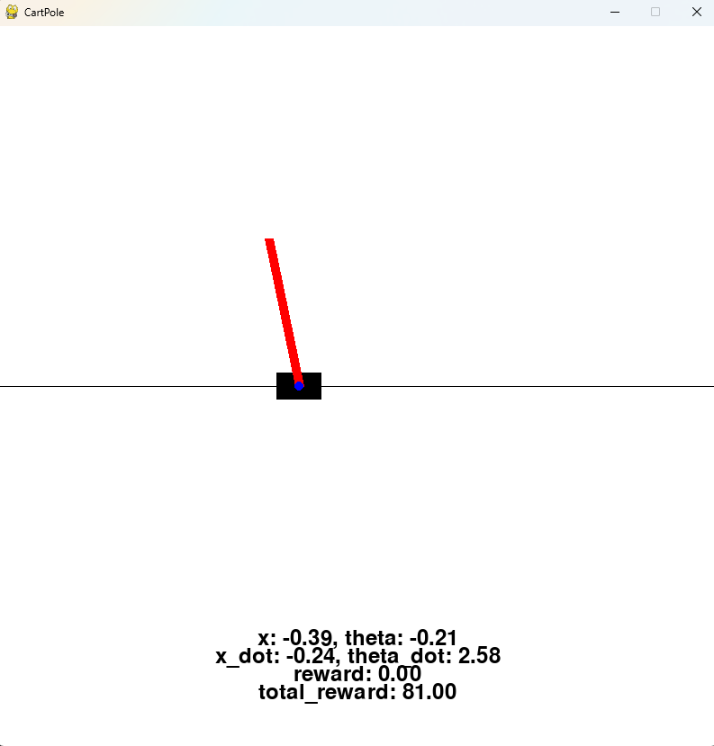

# PendulumDisk

PendulumDisk is an environment where the agent must learn to control an inverted pendulum in the form of a weight attached at the edge of a disk.
  

Different environment setups are presented in [Usage](#usage).

## Usage

### Basic Initialization

```python
from rl_envs_forge.envs.inverted_pendulum.pendulum_disk.pendulum_disk import PendulumDisk

env = PendulumDisk(tau=0.005)  # Set the integration time step to 0.005 seconds
state = env.reset()

action = env.action_space.sample()  # Sample a random action
next_state, reward, done, truncated, info = env.step(action)
print(next_state, reward, done, truncated, info)
```

```
[-0.0055789  -0.32154114] 1.0 False False {'truncated': False, 'alpha_dot_dot': -63.054773984993176, 'force': -2.1126268, 'steps': 1}
```

### Custom Initialization with Continuous Reward
```python
env = PendulumDisk(tau=0.005, continuous_reward=True)
state = env.reset()

action = env.action_space.sample()  # Sample a random action
next_state, reward, done, truncated, info = env.step(action)
print(next_state, reward, done, truncated, info)
```

```
[ 0.00216049 -0.05723835] 0.9993122951478205 False False {'truncated': False, 'alpha_dot_dot': -13.35588768389303, 'force': -0.46010104, 'steps': 1}
```

### Rendering the Environment

```
env = PendulumDisk(tau=0.005)
state = env.reset()

for _ in range(1000):
    env.render()
    action = env.action_space.sample()
    next_state, reward, done, truncated, info = env.step(action)
    if done or truncated:
        break

env.close()
```



