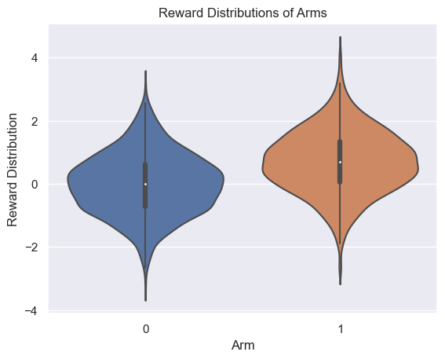
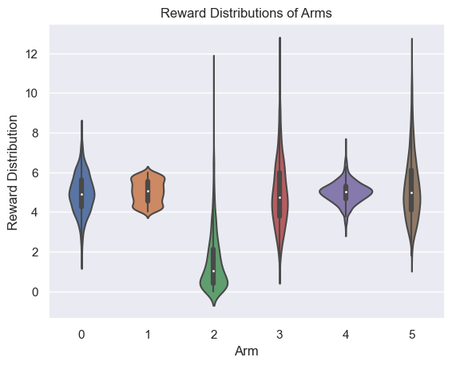

# KArmedBandit environment 

The k-armed bandit problem is a classic dilemma in probability theory and statistics which models the decision-making process of choosing between multiple strategies (or actions) with uncertain outcomes. Imagine standing in front of a slot machine with k levers (or "arms"). Each lever provides a reward drawn from an unknown probability distribution specific to that lever. The challenge is to determine a strategy to maximize your total reward over a series of trials, without knowledge of the underlying distributions.

The Arms can be customized as presented in section [Usage](#usage).

## Usage

Code example for getting started with the environment:

```python
from rl_envs_forge.envs.k_armed_bandit.k_armed_bandit import KArmedBandit

bandit = KArmedBandit(k=10, seed=0)
bandit.step(1)
```

```output
(1, 0.5442007795281013, True, False, {})
```

```python
bandit.render()
```


```python
bandit.render(mode="print")
```

```output
Arm 0:
	Distribution: Normal
	Mean: 1.57
	Std: 1.00
------------------------------
Arm 1:
	Distribution: Normal
	Mean: -0.95
	Std: 1.00
------------------------------
Arm 2:
	Distribution: Normal
	Mean: -1.59
	Std: 1.00

etc...
```


## Customizing an arm
You can customize the distribution of an arm by passing a dictionary that describes the distribution.


```python
custom_bandit = KArmedBandit(k=10, arm_params={1: {"distribution": "normal", "mean": 5, "std": 1}})
custom_bandit.render()
```


## Shifting parameters
You can define how a parameter changes during sampling for an arm:

```python
def linear_increase(timestep):
    return 0.1 * timestep  # Increase by 0.1 every timestep


def linear_decrease(timestep):
    return - 0.01 * timestep  # Decrease by 0.01 every timestep, starting from 1


arm_params = {
    0: {
        "distribution": "normal",
        "mean": 0,
        "std": 1,
        "param_functions": [
            {"function": linear_increase, "target_param": "mean"},
            {"function": linear_decrease, "target_param": "std"},
        ],
    }
}

custom_bandit = KArmedBandit(k=2, arm_params=arm_params)
custom_bandit.render()

for timestep in range(20):
    custom_bandit.step(1)
    
custom_bandit.render()
```

<table>
<tr>
    <th colspan="1">Initial distributions</th>
    <th colspan="1">After extracting 10 samples</th>
</tr>
<tr>
<td>

</td>
<td>

</td>
</tr>

</table>

## Different distributions
Several distribution types can be used for the arm distribution:

```python
arm_params = {
    0: {"distribution": "normal", "mean": 5, "std": 1},
    1: {"distribution": "uniform", "low": 4, "high": 6},
    2: {"distribution": "exponential", "scale": 1.5},  # Adjusted scale for a mean closer to 5.
    3: {"distribution": "gamma", "shape": 9, "scale": 0.55},  # Adjusted to have a mean around 5.
    4: {"distribution": "logistic", "loc": 5, "scale": 0.3},
    5: {"distribution": "lognormal", "mean": 1.6, "sigma": 0.3},  # Adjusted for a mean close to 5.
}

custom_bandit = KArmedBandit(k=6, arm_params=arm_params)
custom_bandit.render(mode="violin_plot")
```



## UML diagrams

### Packages


### Classes


