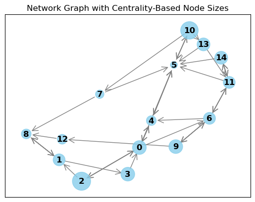

"""
# NetworkGraph

NetworkGraph is an environment where the agent must learn to influence the opinions of a network of agents connected by a graph. The goal is to guide the network's opinions towards a desired value while respecting a budget constraint.

Different environment setups are presented in [Usage](#usage).

## Usage

### Basic Initialization

```python
import numpy as np
from rl_envs_forge.envs.network_graph.network_graph import NetworkGraph

env = NetworkGraph(num_agents=100, max_u=0.1, budget=10.0)  # Initialize with 100 agents
state = env.reset()

action = env.action_space.sample()  # Sample a random action
next_state, reward, done, truncated, info = env.step(action)
```


### Rendering the Environment
```python
import numpy as np
from rl_envs_forge.envs.network_graph.network_graph import NetworkGraph

connectivity_matrix = np.array(
    [
        # 1  2  3  4  5  6  7  8  9 10 11 12 13 14 15
        [0, 0, 1, 0, 1, 1, 1, 0, 0, 0, 0, 0, 0, 0, 0],  # 1
        [0, 0, 0, 1, 0, 0, 0, 0, 1, 0, 0, 0, 0, 0, 0],  # 2
        [1, 1, 0, 0, 0, 0, 0, 0, 0, 0, 0, 0, 0, 0, 0],  # 3
        [1, 0, 0, 0, 0, 0, 0, 0, 0, 0, 0, 0, 0, 0, 0],  # 4
        [1, 0, 0, 0, 0, 1, 0, 0, 0, 0, 0, 0, 0, 0, 0],  # 5
        [0, 0, 0, 0, 1, 0, 0, 0, 0, 0, 1, 0, 0, 0, 0],  # 6
        [0, 0, 0, 0, 1, 0, 0, 0, 0, 1, 0, 1, 0, 0, 0],  # 7
        [0, 0, 0, 0, 0, 1, 0, 0, 1, 0, 0, 0, 0, 0, 0],  # 8
        [0, 1, 0, 0, 0, 0, 0, 0, 0, 0, 0, 0, 0, 0, 0],  # 9
        [0, 0, 0, 0, 0, 0, 1, 0, 0, 0, 0, 0, 1, 0, 0],  # 10
        [0, 0, 0, 0, 0, 1, 0, 1, 0, 0, 0, 0, 0, 1, 0],  # 11
        [0, 0, 0, 0, 0, 1, 1, 0, 0, 0, 0, 0, 0, 0, 1],  # 12
        [0, 0, 0, 0, 0, 0, 0, 0, 1, 0, 0, 0, 0, 0, 0],  # 13
        [0, 0, 0, 0, 0, 1, 0, 0, 0, 0, 0, 1, 0, 0, 0],  # 14
        [0, 0, 0, 0, 0, 1, 0, 0, 0, 0, 0, 1, 0, 0, 0],  # 15
    ]
)

env = NetworkGraph(
    connectivity_matrix=connectivity_matrix,
    max_u=0.1,
    budget=10.0,
    desired_opinion=1.0,
    tau=1.0,
    max_steps=100
)

env.render(mode="matplotlib")
```



### Packages


### Classes

